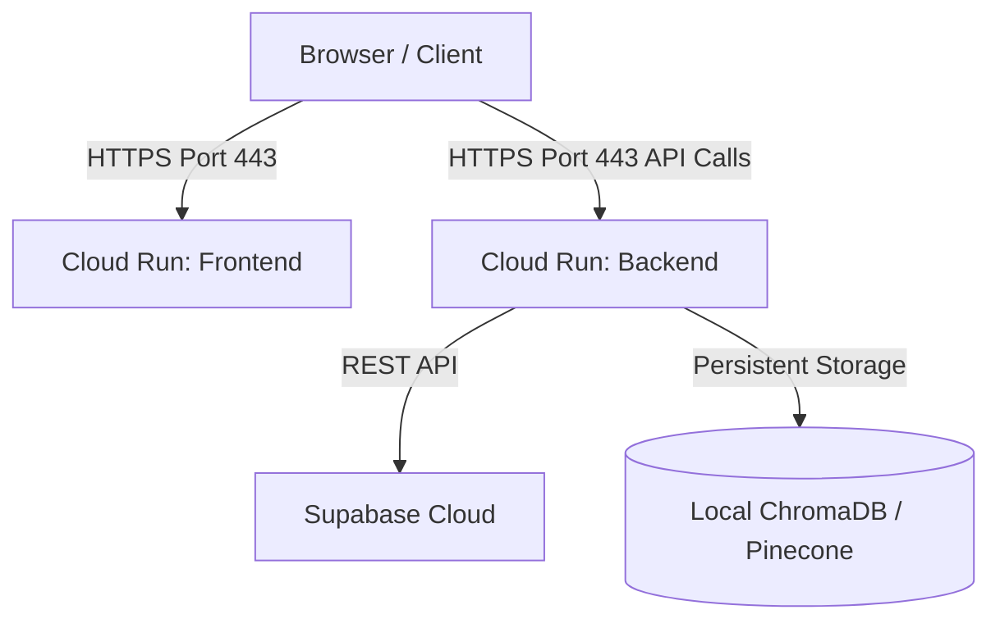

# GCP Deployment Guide - AI Career Intelligence Platform

This document describes how to deploy the containerized AI Career Intelligence Platform (FastAPI backend & Next.js frontend) to Google Cloud Platform (GCP) using **Google Cloud Run**.

---

## Architecture Overview



- **Frontend**: Serves the Next.js static and server components on port 3000. It requires build-time configuration of the backend URL.
- **Backend**: Serves the FastAPI app on port 8000, dynamically binding to the `$PORT` environment variable assigned by Cloud Run.
- **Database**: Connects to the Supabase PostgreSQL database.
- **Vector Store**: Resolves user queries using ChromaDB. For high-availability/production configurations, Pinecone is recommended.

---

## Option 1: Automated Deployment (Recommended)

We provide a deployment script [`deploy-gcp.sh`](file:///e:/OneDrive/Desktop/AIC/ai-career-platform/deploy-gcp.sh) at the root of the project to automate the build and deploy pipeline.

### Steps:

1. **Prerequisites**:
   - Install the [Google Cloud CLI (gcloud)](https://cloud.google.com/sdk/docs/install).
   - Initialize and authenticate gcloud:
     ```bash
     gcloud init
     gcloud auth login
     ```
   - Ensure the required APIs are enabled in your GCP project:
     ```bash
     gcloud services enable artifactregistry.googleapis.com \
                            cloudbuild.googleapis.com \
                            run.googleapis.com
     ```

2. **Configure Script**:
   Open [`deploy-gcp.sh`](file:///e:/OneDrive/Desktop/AIC/ai-career-platform/deploy-gcp.sh) and fill in your details:
   - `GCP_PROJECT_ID`: Your GCP Project ID.
   - `GCP_REGION`: The GCP region to deploy to (e.g., `us-central1`).
   - `SUPABASE_URL` & `SUPABASE_ANON_KEY`: Found in Supabase Settings -> API.

3. **Run Deployment**:
   ```bash
   chmod +x deploy-gcp.sh
   ./deploy-gcp.sh
   ```

---

## Option 2: Step-by-Step Manual Deployment

If you prefer to run the commands manually or integrate them into a custom CI/CD pipeline, follow these steps:

### 1. Set Google Cloud Project
```bash
gcloud config set project YOUR_PROJECT_ID
```

### 2. Create Artifact Registry Repository
```bash
gcloud artifacts repositories create ai-career-platform \
    --repository-format=docker \
    --location=us-central1 \
    --description="Docker repository for Career Platform"
```

### 3. Build & Deploy Backend
Build and push the image using GCP Cloud Build:
```bash
gcloud builds submit --tag us-central1-docker.pkg.dev/YOUR_PROJECT_ID/ai-career-platform/backend:latest ./backend
```
Deploy the image to Cloud Run:
```bash
gcloud run deploy career-backend \
    --image us-central1-docker.pkg.dev/YOUR_PROJECT_ID/ai-career-platform/backend:latest \
    --region us-central1 \
    --platform managed \
    --allow-unauthenticated \
    --port 8000 \
    --set-env-vars="SUPABASE_URL=YOUR_SUPABASE_URL,SUPABASE_ANON_KEY=YOUR_SUPABASE_ANON_KEY,SUPABASE_SERVICE_ROLE_KEY=YOUR_SUPABASE_SERVICE_ROLE_KEY"
```

### 4. Build & Deploy Frontend
Retrieve the deployed backend URL:
```bash
BACKEND_URL=$(gcloud run services describe career-backend --region us-central1 --format 'value(status.url)')
```
Build and push the frontend image, passing the backend URL as a build argument:
```bash
gcloud builds submit --tag us-central1-docker.pkg.dev/YOUR_PROJECT_ID/ai-career-platform/frontend:latest \
    --build-arg="NEXT_PUBLIC_SUPABASE_URL=YOUR_SUPABASE_URL" \
    --build-arg="NEXT_PUBLIC_SUPABASE_ANON_KEY=YOUR_SUPABASE_ANON_KEY" \
    --build-arg="NEXT_PUBLIC_API_URL=$BACKEND_URL" \
    ./frontend
```
Deploy the frontend to Cloud Run:
```bash
gcloud run deploy career-frontend \
    --image us-central1-docker.pkg.dev/YOUR_PROJECT_ID/ai-career-platform/frontend:latest \
    --region us-central1 \
    --platform managed \
    --allow-unauthenticated \
    --port 3000
```

### 5. Update Backend Allowed CORS Origins
Retrieve the frontend URL:
```bash
FRONTEND_URL=$(gcloud run services describe career-frontend --region us-central1 --format 'value(status.url)')
```
Update the backend with the frontend URL to allow successful requests:
```bash
gcloud run services update career-backend \
    --region us-central1 \
    --update-env-vars="ALLOWED_ORIGINS=http://localhost:3000,http://localhost:8000,$FRONTEND_URL"
```

---

## Production Security Hardening

> [!TIP]
> **Use Secret Manager for Keys**:
> Do not store keys like `SUPABASE_SERVICE_ROLE_KEY`, `OPENAI_API_KEY`, or `ANTHROPIC_API_KEY` in plain text environment variables. Use **GCP Secret Manager**.
>
> 1. Create a secret:
>    ```bash
>    gcloud secrets create OPENAI_API_KEY --data-file=- <<< "your-openai-api-key"
>    ```
> 2. Grant the Cloud Run Service Account access to read the secret:
>    ```bash
>    gcloud secrets add-iam-policy-binding OPENAI_API_KEY \
>        --member="serviceAccount:YOUR_PROJECT_NUMBER-compute@developer.gserviceaccount.com" \
>        --role="roles/secretmanager.secretAccessor"
>    ```
> 3. Bind the secret in Cloud Run:
>    ```bash
>    gcloud run services update career-backend \
>        --region us-central1 \
>        --update-secrets="OPENAI_API_KEY=OPENAI_API_KEY:latest"
>    ```

---

## Production Statefulness for ChromaDB

Because Google Cloud Run container instances are stateless, any documents processed and stored in the local `chroma_db` database inside the container will disappear when the container scales down or restarts.

To ensure vectors persist:

### Option A: Cloud Run Volume Mount (GCS Bucket)
Cloud Run allows mounting a Google Cloud Storage bucket directly to the container as a filesystem volume.
1. Create a GCS bucket:
   ```bash
   gcloud storage buckets create gs://your-chromadb-bucket --location=us-central1
   ```
2. Deploy/Update Cloud Run to mount the bucket to `/app/chroma_db`:
   ```bash
   gcloud beta run services update career-backend \
       --region us-central1 \
       --add-volume=name=chromadb-vol,type=cloud-storage,bucket=your-chromadb-bucket \
       --add-volume-mount=volume=chromadb-vol,mount-path=/app/chroma_db
   ```

### Option B: Pinecone Vector Database
Switch the database provider configuration to use Pinecone (by providing the production keys `PINECONE_API_KEY` and `PINECONE_ENVIRONMENT`), which stores the vectors in a hosted, persistent database.
